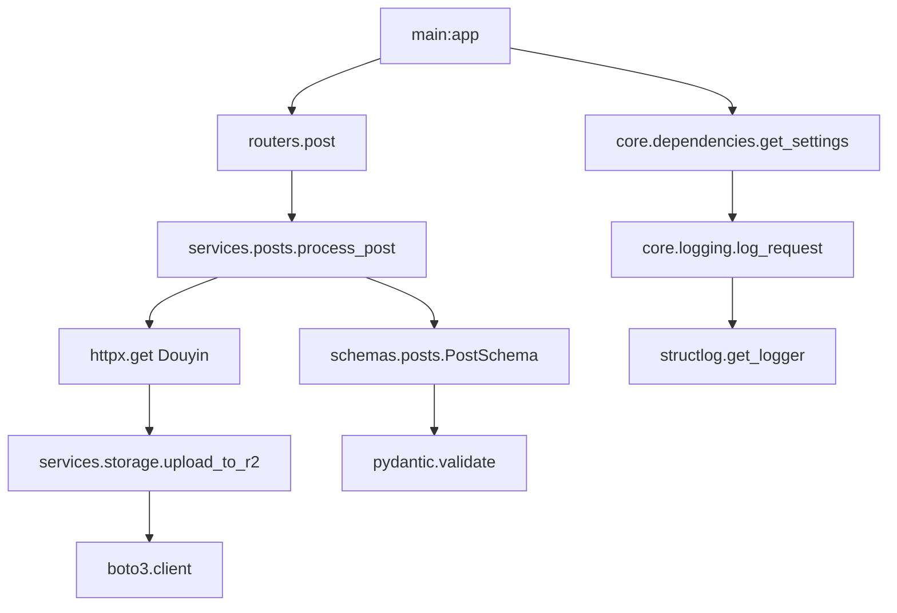

# Call Graph

_Last Updated: 2025-10-07_

## Description

Function and method call relationships within the codebase.

<!--@auto:diagram:call:start-->

```mermaid
graph TD
    Main[main:app] --> Router[routers.post]
    Router --> Service[services.posts.process_post]
    Service --> Schema[schemas.posts.PostSchema]
    Service --> External[httpx.get Douyin]
    External --> Storage[services.storage.upload_to_r2]
    Storage --> Boto3[boto3.client]
    Schema --> Pydantic[pydantic.validate]
    Main --> Core[core.dependencies.get_settings]
    Core --> Logging[core.logging.log_request]
    Logging --> StructLog[structlog.get_logger]
```

<!--@auto:diagram:call:end-->
