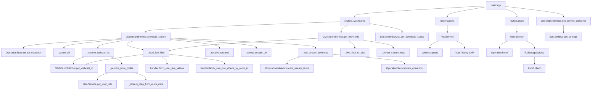

# Call Graph

_Last Updated: 2026-04-17_

## Description

Function and method call relationships within the codebase, with detailed coverage of the livestream download pipeline.

<!--@auto:diagram:call:start-->

<!--@auto:diagram:call:end-->
