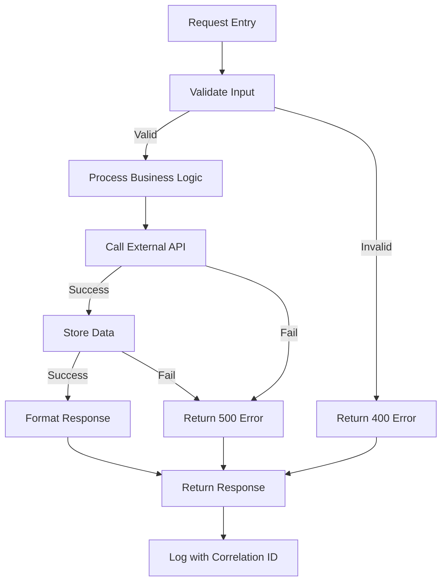

# Control Flow Graph

_Last Updated: 2025-10-07_

## Description

Control flow showing decision points, error paths, and conditional logic in request processing.

<!--@auto:diagram:cfg:start-->

<!--@auto:diagram:cfg:end-->
