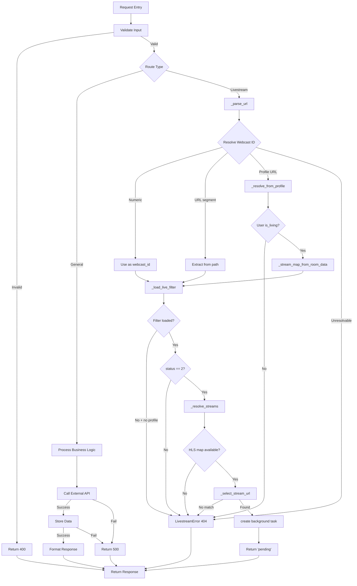

# Control Flow Graph

_Last Updated: 2026-04-07_

## Description

Control flow showing decision points, error paths, and conditional logic in request processing. Covers the livestream download pipeline and general request handling.

<!--@auto:diagram:cfg:start-->

```mermaid
graph TD
    Start[Request Entry] --> Validate[Validate Input]
    Validate -->|Invalid| Error400[Return 400]
    Validate -->|Valid| Route{Route Type}

    Route -->|General| Process[Process Business Logic]
    Route -->|Livestream| ParseURL[_parse_url]

    ParseURL --> ResolveID{Resolve Webcast ID}
    ResolveID -->|Numeric| DirectID[Use as webcast_id]
    ResolveID -->|URL segment| ExtractID[Extract from path]
    ResolveID -->|Profile URL| ProfileLookup[_resolve_from_profile]
    ResolveID -->|Unresolvable| LiveErr[LivestreamError 404]

    ProfileLookup --> IsLive{User is_living?}
    IsLive -->|No| LiveErr
    IsLive -->|Yes| StreamMaps[_stream_map_from_room_data]

    DirectID --> LoadFilter[_load_live_filter]
    ExtractID --> LoadFilter
    StreamMaps --> LoadFilter

    LoadFilter --> FilterOK{Filter loaded?}
    FilterOK -->|No + no profile| LiveErr
    FilterOK -->|Yes| CheckStatus{status == 2?}

    CheckStatus -->|No| LiveErr
    CheckStatus -->|Yes| ResolveStreams[_resolve_streams]

    ResolveStreams --> HasHLS{HLS map available?}
    HasHLS -->|No| LiveErr
    HasHLS -->|Yes| SelectQuality[_select_stream_url]

    SelectQuality -->|No match| LiveErr
    SelectQuality -->|Found| StartTask[create background task]
    StartTask --> ReturnPending[Return 'pending']

    Process --> CallExternal[Call External API]
    CallExternal -->|Success| Store[Store Data]
    CallExternal -->|Fail| Error500[Return 500]
    Store -->|Success| Respond[Format Response]
    Store -->|Fail| Error500

    Respond --> End[Return Response]
    ReturnPending --> End
    LiveErr --> End
    Error400 --> End
    Error500 --> End
```

<!--@auto:diagram:cfg:end-->
