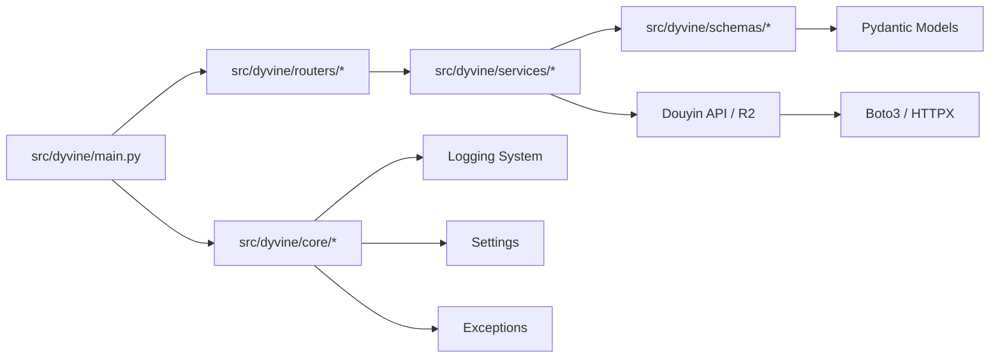

# Dependency Graph

_Last Updated: 2025-10-07_

## Description

Module dependencies and package relationships in the codebase.

<!--@auto:diagram:deps:start-->

```mermaid
graph LR
    Main[src/dyvine/main.py] --> Routers[src/dyvine/routers/*]
    Main --> Core[src/dyvine/core/*]
    Routers --> Services[src/dyvine/services/*]
    Services --> Schemas[src/dyvine/schemas/*]
    Services --> External[Douyin API / R2]
    Core --> Logging[Logging System]
    Core --> Settings[Settings]
    Core --> Exceptions[Exceptions]
    Schemas --> Pydantic[Pydantic Models]
    External --> Boto3[Boto3 / HTTPX]
```

<!--@auto:diagram:deps:end-->
