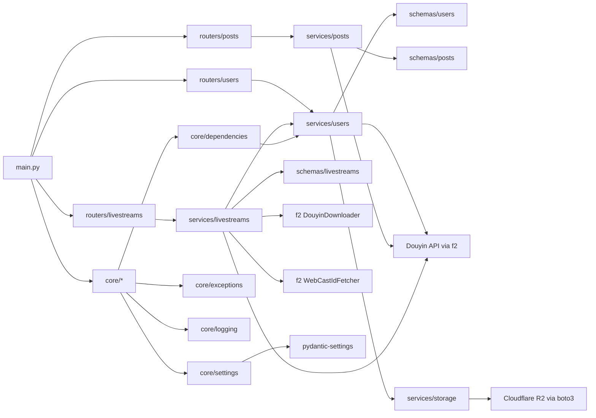

# Dependency Graph

_Last Updated: 2026-04-07_

## Description

Module dependencies and package relationships in the codebase, including the livestream service integration with f2.

<!--@auto:diagram:deps:start-->

<!--@auto:diagram:deps:end-->
