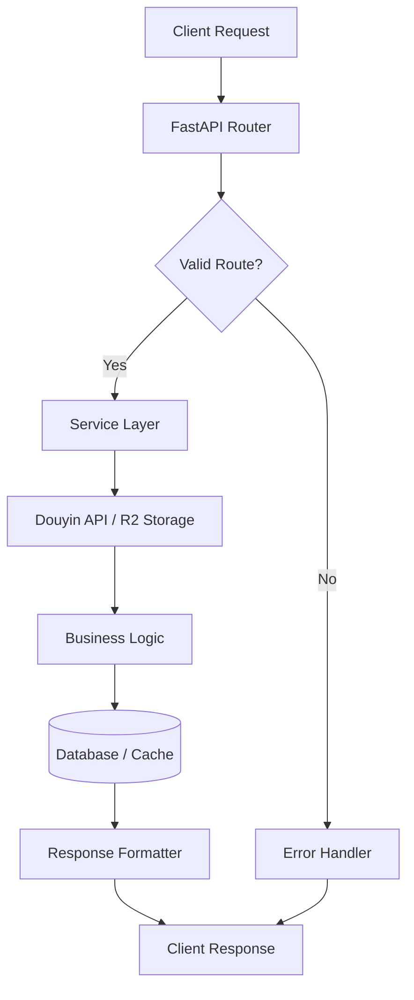

# Flowchart

_Last Updated: 2025-10-07_

## Description

End-to-end request processing with decisions and data stores.

<!--@auto:diagram:flow:start-->

```mermaid
flowchart TD
    A[Client Request] --> B[FastAPI Router]
    B --> C{Valid Route?}
    C -->|Yes| D[Service Layer]
    C -->|No| E[Error Handler]
    D --> F[Douyin API / R2 Storage]
    F --> G[Business Logic]
    G --> H[(Database / Cache)]
    H --> I[Response Formatter]
    I --> J[Client Response]
    E --> J
```

<!--@auto:diagram:flow:end-->
