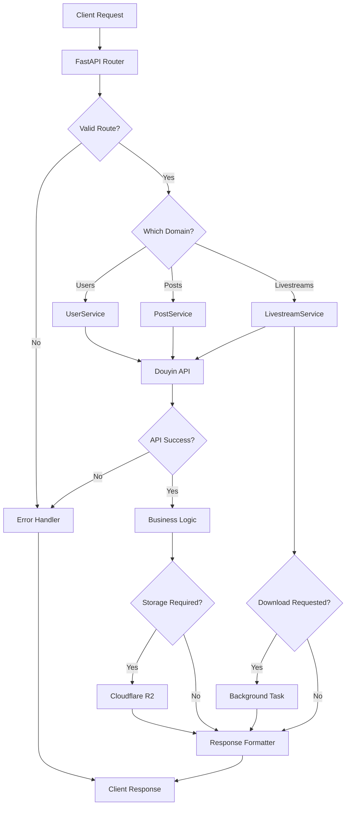

# Flowchart

_Last Updated: 2026-04-07_

## Description

End-to-end request processing with decisions and data stores, covering all three feature domains: users, posts, and livestreams.

<!--@auto:diagram:flow:start-->

<!--@auto:diagram:flow:end-->
