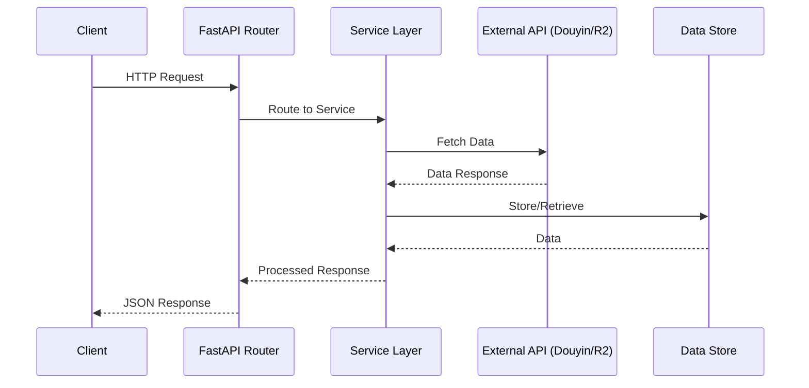

# Sequence Diagram

_Last Updated: 2025-10-07_

## Description

Sequence of interactions for a typical API request, showing component communications.

<!--@auto:diagram:seq:start-->

<!--@auto:diagram:seq:end-->
