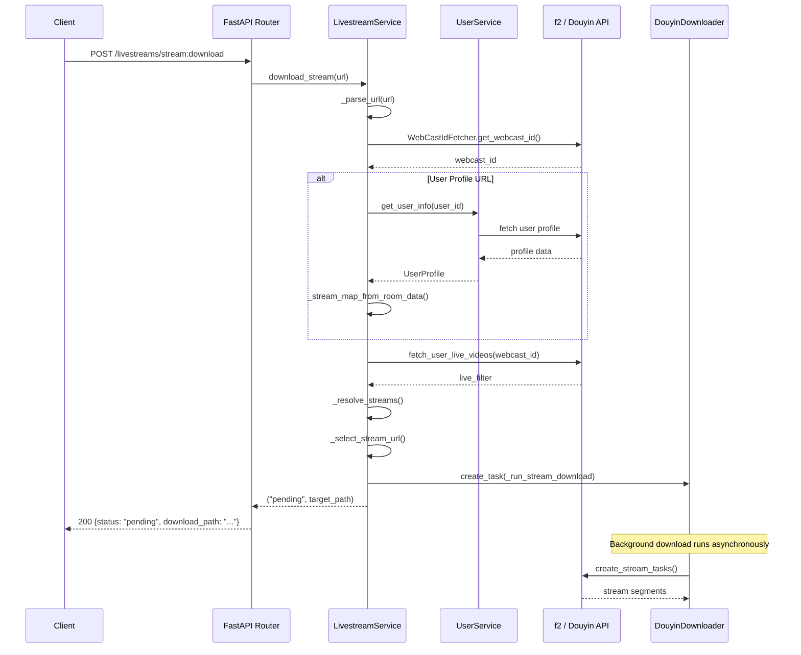

# Sequence Diagram

_Last Updated: 2026-04-07_

## Description

Sequence of interactions for livestream download and standard API requests, showing component communications.

<!--@auto:diagram:seq:start-->

```mermaid
sequenceDiagram
    participant C as Client
    participant R as FastAPI Router
    participant LS as LivestreamService
    participant US as UserService
    participant F2 as f2 / Douyin API
    participant DL as DouyinDownloader

    C->>R: POST /livestreams/stream:download
    R->>LS: download_stream(url)
    LS->>LS: _parse_url(url)
    LS->>F2: WebCastIdFetcher.get_webcast_id()
    F2-->>LS: webcast_id

    alt User Profile URL
        LS->>US: get_user_info(user_id)
        US->>F2: fetch user profile
        F2-->>US: profile data
        US-->>LS: UserProfile
        LS->>LS: _stream_map_from_room_data()
    end

    LS->>F2: fetch_user_live_videos(webcast_id)
    F2-->>LS: live_filter
    LS->>LS: _resolve_streams()
    LS->>LS: _select_stream_url()
    LS->>DL: create_task(_run_stream_download)
    LS-->>R: ("pending", target_path)
    R-->>C: 200 {status: "pending", download_path: "..."}

    Note over DL: Background download runs asynchronously
    DL->>F2: create_stream_tasks()
    F2-->>DL: stream segments
```

<!--@auto:diagram:seq:end-->
